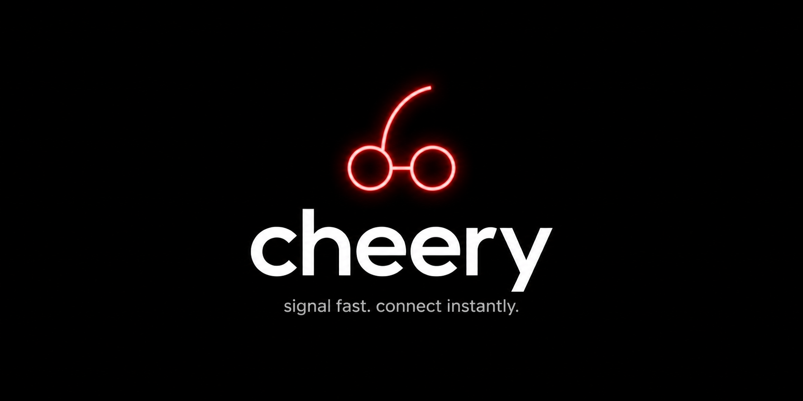

<div align="center">

<!-- Replace with your own banner — recommended: 1280×640px, dark background -->


<br/>
<br/>

<h1>🍒 cheery</h1>

<p><strong>Minimal, blazing-fast WebRTC signaling server.<br/>Zero dependencies beyond Python. No Redis. No cloud bill.</strong></p>

<br/>

[](https://www.python.org/)
[](https://github.com/MagicStack/uvloop)
[](./LICENSE)
[](../../pulls)

<br/>



<br/>
<br/>

</div>

---

## What is cheery?

**cheery** is a lean TCP signaling server that brokers WebRTC peer connections — handling `CREATE`, `JOIN`, `OFFER`, `ANSWER`, and `ICE` — then gets out of the way. Once your peers are connected, all traffic flows directly between them. cheery never touches your media.

- **No Redis.** State lives in a single Python dict, freed the moment both peers disconnect.
- **No frameworks.** Pure `asyncio` + `uvloop`. The entire server is one file.
- **Production ready.** Ships with an nginx config (TLS, rate limiting) and a systemd unit (auto-restart, process hardening).

---

## Features

| | |
|---|---|
| ⚡ **uvloop event loop** | ~2× faster than standard asyncio, automatic fallback |
| 🔒 **TLS out of the box** | nginx terminates SSL with a free Let's Encrypt cert |
| 🏠 **Room-based signaling** | 6-digit room codes, one creator + one joiner per room |
| 🧹 **Clean memory model** | Room freed only when *both* peers disconnect — no orphans |
| 🛡️ **Abuse protection** | nginx rate limiting: 10 req/s, 20 concurrent sockets per IP |
| 🔁 **Auto-restart** | systemd `Restart=always` keeps it alive after crashes |
| 🧪 **Full test suite** | 12 tests covering lifecycle, stress (100 rooms), flood (50 pairs) |

---

## Quick start

```bash
# 1. Clone
git clone https://github.com/you/cheery.git && cd cheery

# 2. Install (uvloop is optional but recommended)
pip install uvloop

# 3. Run
python cheery.py
```

Server starts on `0.0.0.0:8766`. You'll see:

```
2024-01-01 00:00:00 INFO ✅ cheery running on 0.0.0.0:8766  [event loop: uvloop]
```

---

## Protocol

Every message is a binary frame:

```
┌──────────┬────────────────┬─────────────────┐
│  cmd     │  length (4B)   │  payload        │
│  1 byte  │  little-endian │  0–N bytes      │
└──────────┴────────────────┴─────────────────┘
```

### Commands (client → server)

| Byte | Command | Payload |
|------|---------|---------|
| `0x01` | `CREATE` | _(none)_ |
| `0x02` | `JOIN` | 4-byte room code (LE) |
| `0x03` | `OFFER` | SDP bytes |
| `0x04` | `ANSWER` | SDP bytes |
| `0x05` | `ICE` | candidate bytes |

### Responses (server → client)

| Byte | Response | Payload |
|------|----------|---------|
| `0x10` | `ROOM_CREATED` | 4-byte room code (LE) |
| `0x11` | `JOIN_OK` | _(none)_ |
| `0x20` | `OFFER_FWD` | forwarded SDP |
| `0x21` | `ANSWER_FWD` | forwarded SDP |
| `0x22` | `ICE_FWD` | forwarded candidate |
| `0x7F` | `ERROR` | _(none)_ |

### Signaling flow

```
Creator                  cheery                  Joiner
   │                       │                       │
   │──── CREATE ──────────►│                       │
   │◄─── ROOM_CREATED ─────│                       │
   │                       │◄──── JOIN ────────────│
   │                       │───── JOIN_OK ─────────►│
   │──── OFFER ───────────►│───── OFFER_FWD ───────►│
   │                       │◄──── ANSWER ───────────│
   │◄─── ANSWER_FWD ───────│                       │
   │──── ICE ─────────────►│───── ICE_FWD ─────────►│
   │◄─── ICE_FWD ──────────│◄──── ICE ─────────────│
   │                       │                       │
   │        P2P connection established             │
   │◄══════════════════════════════════════════════│
```

---


## Running the tests

```bash
python test_cheery.py
```

```
🧪 STARTING TESTS FOR CHEERY SERVER
⚡ Event loop: uvloop
──────────────────────────────────────────────────────────
📦 Basic Functionality
  Test  1: ✅ PASS — single client creates a room
  Test  2: ✅ PASS — two clients create and join
  Test  3: ✅ PASS — 10 parallel creates
  Test  4: ✅ PASS — invalid join returns error
  Test  5: ✅ PASS — second joiner rejected
  Test  6: ✅ PASS — OFFER forwarded

📦 Stress & Performance
  Test  7: ✅ PASS — 100 concurrent rooms
  Test  8: ✅ PASS — rapid join/leave x20
  Test  9: ✅ PASS — bidirectional messaging
  Test 10: ✅ PASS — 50 room pairs flooded

📦 Connection Lifecycle
  Test 11: ✅ PASS — full OFFER → ANSWER → ICE flow
  Test 12: ✅ PASS — 100 messages, long-lived connection

📈 Total: 12/12 tests passed  🎉 ALL TESTS PASSED!
```

---

## Files

```
cheery/
├── cheery.py            # Server (the whole thing)
├── cheery.service       # systemd: auto-restart + process hardening
├── test_cheery.py       # 12 tests, runs on uvloop
└── README.md
```

---

## License

MIT — do whatever you want with it.

---

<div align="center">
<sub>built by ❤️ and zero cloud bills</sub>
</div>